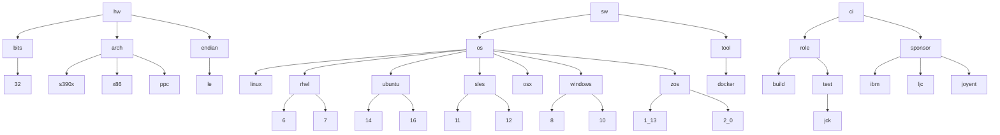

# Schema for Jenkins Labels

## The Schema Tree

  

## Actual Labels and Consumers

If we work on the principle that we only add a label if the build and test automation scripts require it in order to differentiate a machine, then the list is fairly small.

Label | Consumer 
----------- | ----------- 
hw.arch.s390x | test, build 
hw.arch.ppc64 | test, build 
hw.arch.x86 | test, build
| 
hw.endian.le | test, build
| 
hw.bits.32 | test, build
|
|
sw.os.linux | test
sw.os.rhel.6 | tbd
sw.os.rhel.7 | tbd
sw.os.ubuntu.14 | tbd
sw.os.ubuntu.16 | tbd
sw.os.sles.11 | tbd
sw.os.sles.12 | tbd
|
sw.os.aix.6 | tbd
sw.os.aix.7 | tbd
|
sw.os.osx.10 | tbd
|
sw.os.windows.8 | tbd
sw.os.windows.10 | tbd
|
sw.tool.docker | [external tests](https://ci.adoptopenjdk.net/view/External%20tests/)
|
|
ci.role.build | build
ci.role.test | test
ci.role.test.jck | [jck tests](https://ci.adoptopenjdk.net/view/JCK%20tests/)
|
ci.sponsor.ibm |
ci.sponsor.ljc |
ci.sponsor.joyent |